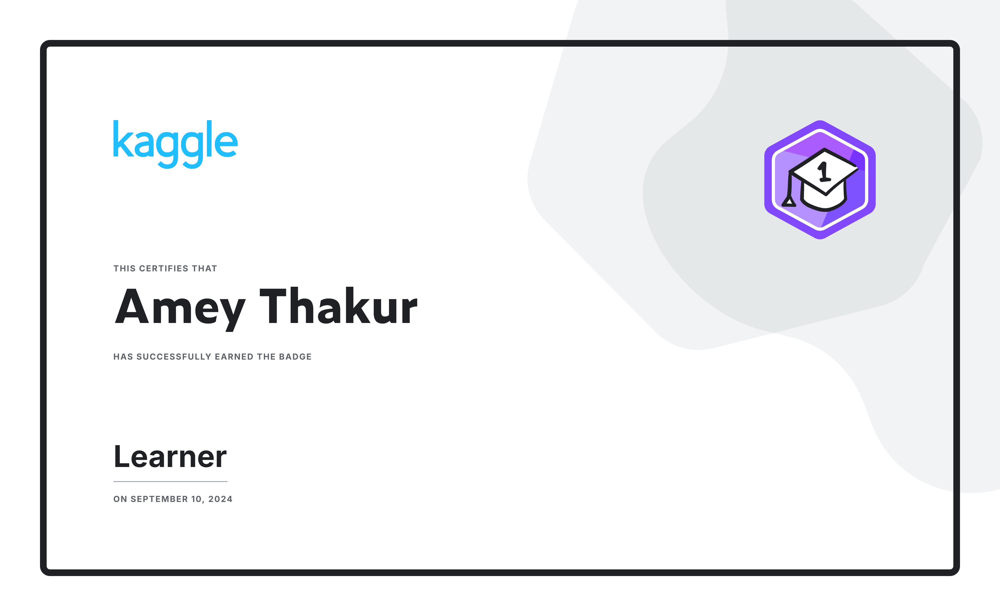
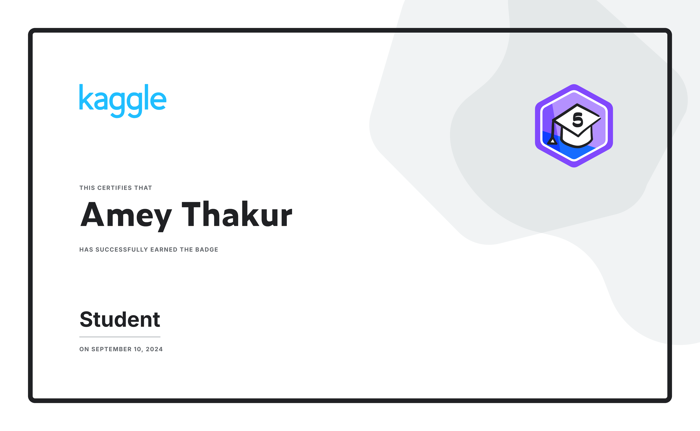
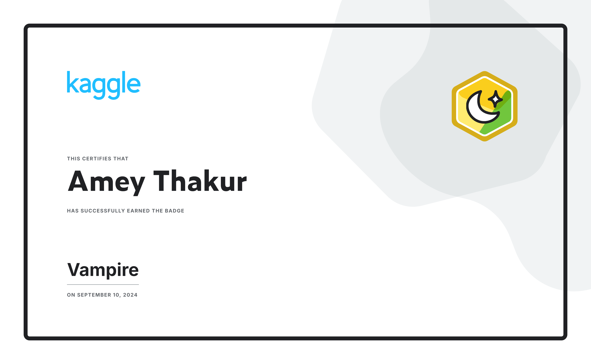
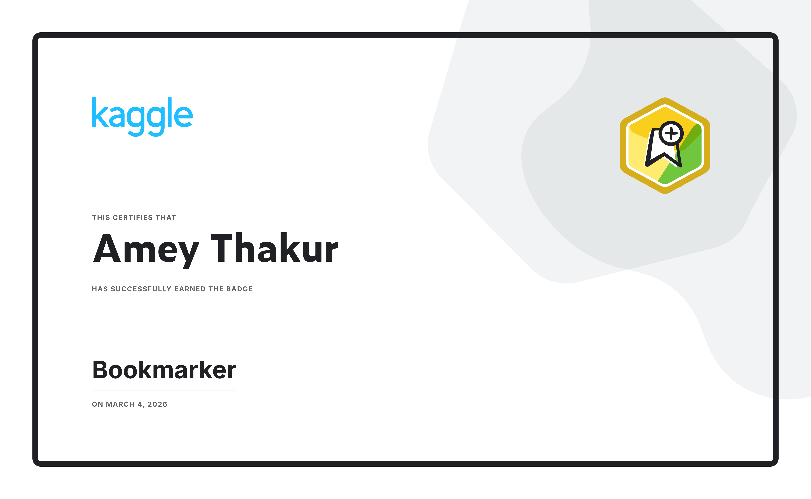
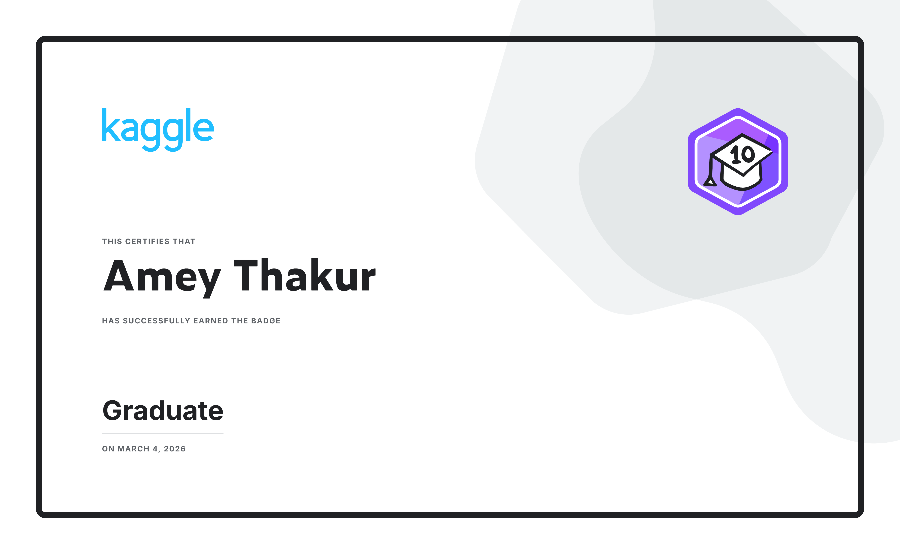
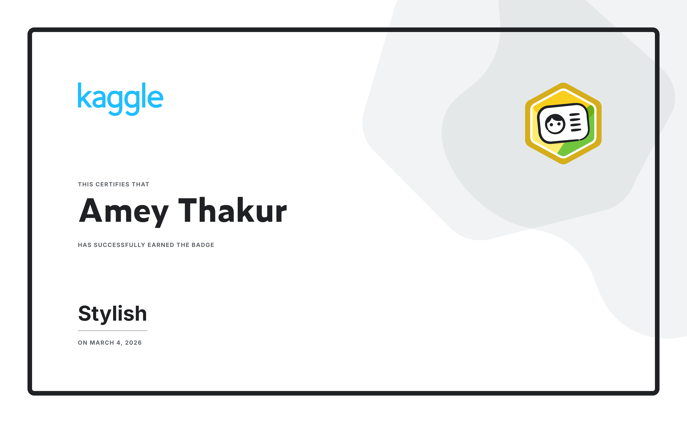
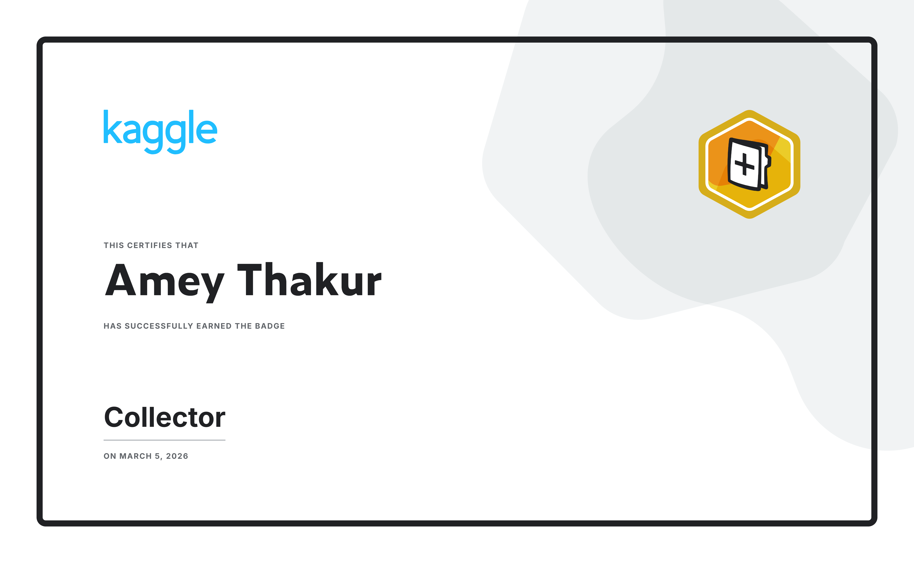
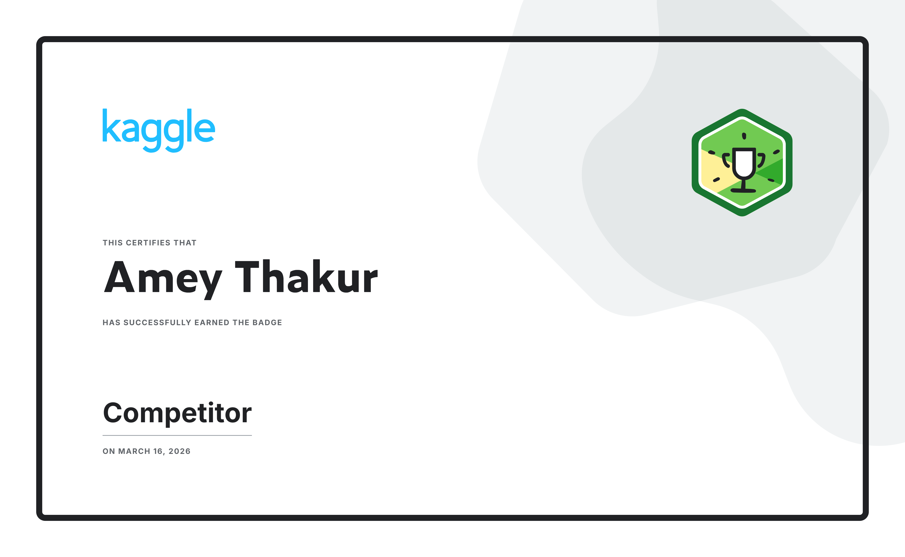

# Kaggle Badges

**41 badges earned on Kaggle, each with the certificate that came with it.**

 

 

[Repository home](../../README.md) &nbsp;·&nbsp; [Competitions](../../README.md#competitions) &nbsp;·&nbsp; [Badges](../../Achievements/Badges/README.md) &nbsp;·&nbsp; [Courses](../../Kaggle%20Courses/README.md) &nbsp;·&nbsp; [Kaggle Profile](https://www.kaggle.com/ameythakur20)

---

Badges mark activity rather than placement: publishing a notebook, keeping a
submission streak, documenting a dataset, finishing a course. They are listed
in the order they were earned, so the table doubles as a record of when each
part of the platform was first used.

| 
#
 | Badge Name | Date Earned | 
Badge Logo
 | 
Certificate
 |
| :---: | :--- | :--- | :---: | :---: |
| 1 | **Kaggle Community Member** | Sept 11, 2022 |  |  |
| 2 | **Code Forker** | Sept 10, 2024 |  |  |
| 3 | **Code Tagger** | Sept 10, 2024 |  |  |
| 4 | **Code Uploader** | Sept 10, 2024 |  |  |
| 5 | **Dataset Creator** | Sept 10, 2024 |  |  |
| 6 | **Learner** | Sept 10, 2024 |  |  |
| 7 | **Python Coder** | Sept 10, 2024 |  |  |
| 8 | **R Coder** | Sept 10, 2024 |  |  |
| 9 | **Student** | Sept 10, 2024 |  |  |
| 10 | **Vampire** | Sept 10, 2024 |  |  |
| 11 | **1 Year on Kaggle** | Sept 11, 2024 |  |  |
| 12 | **2 Years on Kaggle** | Sept 11, 2024 |  |  |
| 13 | **Agent of Discord** | Feb 01, 2026 |  |  |
| 14 | **7 Day Login Streak** | Feb 04, 2026 |  |  |
| 15 | **Dataset Documenter** | Feb 25, 2026 |  |  |
| 16 | **Dataset Tagger** | Feb 25, 2026 |  |  |
| 17 | **30 Day Login Streak** | Feb 27, 2026 |  |  |
| 18 | **Getting Started Competitor** | Mar 03, 2026 |  |  |
| 19 | **Simulation Competitor** | Mar 03, 2026 |  |  |
| 20 | **Bookmarker** | Mar 04, 2026 |  |  |
| 21 | **Graduate** | Mar 04, 2026 |  |  |
| 22 | **Stylish** | Mar 04, 2026 |  |  |
| 23 | **Collector** | Mar 05, 2026 |  |  |
| 24 | **Playground Competitor** | Mar 05, 2026 |  |  |
| 25 | **Github Coder** | Mar 06, 2026 |  |  |
| 26 | **Colab Coder** | Mar 06, 2026 |  |  |
| 27 | **Competitor** | Mar 16, 2026 |  |  |
| 28 | **March Mania Competitor** | Mar 16, 2026 |  |  |
| 29 | **Code Submitter** | Mar 18, 2026 |  |  |
| 30 | **Community Competitor** | Mar 22, 2026 |  |  |
| 31 | **R Markdown Coder** | Mar 24, 2026 |  |  |
| 32 | **API Notebook Creator** | Mar 24, 2026 |  |  |
| 33 | **Notebook Modeler** | Mar 24, 2026 |  |  |
| 34 | **Utility Scripter** | Mar 24, 2026 |  |  |
| 35 | **API Dataset Creator** | Mar 24, 2026 |  |  |
| 36 | **Competition Modeler** | Mar 24, 2026 |  |  |
| 37 | **Research Competitor** | Mar 25, 2026 |  |  |
| 38 | **Submission Streak** | Mar 29, 2026 |  |  |
| 39 | **Super Submission Streak** | Apr 21, 2026 |  |  |
| 40 | **100 Day Login Streak** | May 07, 2026 |  |  |
| 41 | **5 Years on Kaggle** | Jul 05, 2026 |  |  |

---

**Amey Thakur** &nbsp;·&nbsp; [Kaggle](https://www.kaggle.com/ameythakur20) &nbsp;·&nbsp; [GitHub](https://github.com/Amey-Thakur) &nbsp;·&nbsp; [ORCID](https://orcid.org/0000-0001-5644-1575)

 

[↑ Back to top](#kaggle-badges) &nbsp;·&nbsp; [← Repository home](../../README.md)

