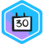
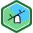
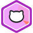

# Kaggle Badges

This directory serves as a scholarly archive for all earned Kaggle badges. Each badge represents a specific achievement and milestone in the Kaggle community, reflecting continuous learning, engagement, and proficiency in competitive data science.

  

---

## Badge Portfolio

| 
#
 | Badge Name | Date Earned | 
Badge Logo
 |
| :---: | :--- | :--- | :---: |
| 1 | **Kaggle Community Member** | Sept 11, 2022 |  |
| 2 | **Code Forker** | Sept 10, 2024 |  |
| 3 | **Code Tagger** | Sept 10, 2024 |  |
| 4 | **Code Uploader** | Sept 10, 2024 |  |
| 5 | **Dataset Creator** | Sept 10, 2024 |  |
| 6 | **Learner** | Sept 10, 2024 |  |
| 7 | **Python Coder** | Sept 10, 2024 |  |
| 8 | **R Coder** | Sept 10, 2024 |  |
| 9 | **Student** | Sept 10, 2024 |  |
| 10 | **Vampire** | Sept 10, 2024 |  |
| 11 | **1 Year on Kaggle** | Sept 11, 2024 |  |
| 12 | **2 Years on Kaggle** | Sept 11, 2024 |  |
| 13 | **Agent of Discord** | Feb 01, 2026 |  |
| 14 | **7 Day Login Streak** | Feb 04, 2026 |  |
| 15 | **Dataset Documenter** | Feb 25, 2026 |  |
| 16 | **Dataset Tagger** | Feb 25, 2026 |  |
| 17 | **30 Day Login Streak** | Feb 27, 2026 |  |
| 18 | **Getting Started Competitor** | Mar 03, 2026 |  |
| 19 | **Simulation Competitor** | Mar 03, 2026 |  |
| 20 | **Bookmarker** | Mar 04, 2026 |  |
| 21 | **Graduate** | Mar 04, 2026 |  |
| 22 | **Stylish** | Mar 04, 2026 |  |
| 23 | **Collector** | Mar 05, 2026 |  |
| 24 | **Playground Competitor** | Mar 05, 2026 |  |
| 25 | **Github Coder** | Mar 06, 2026 |  |
| 26 | **Colab Coder** | Mar 06, 2026 |  |
| 27 | **Competitor** | Mar 16, 2026 |  |
| 28 | **March Mania Competitor** | Mar 16, 2026 |  |
| 29 | **Code Submitter** | Mar 18, 2026 |  |
| 30 | **Community Competitor** | Mar 22, 2026 |  |
| 31 | **R Markdown Coder** | Mar 24, 2026 |  |

---

  [↑ Back to Top](#readme-top) &nbsp;·&nbsp; [← Back to Home](../README.md)

