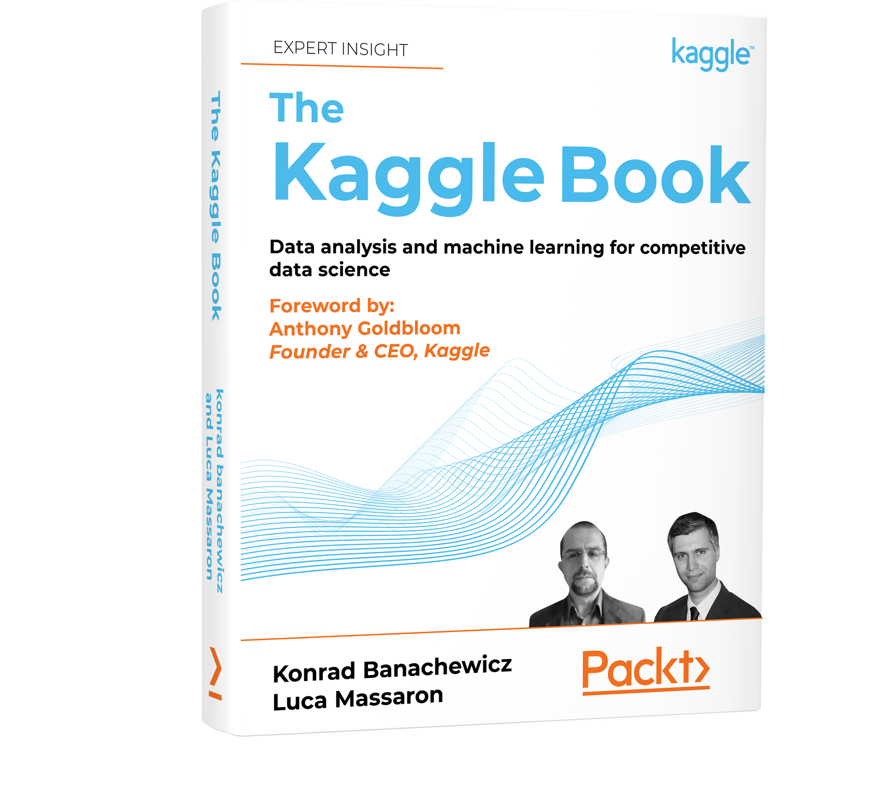

<div align="center">

<a href="https://www.kaggle.com/ameythakur20" title="Kaggle profile"></a>

# Kaggle Competitions

**Solutions, notebooks and write-ups from competitive data science, kept as they were worked.**

<br>

[](https://www.kaggle.com/ameythakur20)
[](https://www.kaggle.com/ameythakur20/code)
[](#achievements)
[](Achievements/Badges/README.md)
[](Kaggle%20Courses/README.md)
[](#competitions)
[](#license)

<br>

[Competitions](#competitions) &nbsp;·&nbsp;
[Achievements](#achievements) &nbsp;·&nbsp;
[Courses](#courses) &nbsp;·&nbsp;
[Toolbox](#toolbox) &nbsp;·&nbsp;
[Structure](#structure) &nbsp;·&nbsp;
[Using this repository](#using-this-repository) &nbsp;·&nbsp;
[License](#license)

<br>

  
  
  
  
  
  
  
  
  
  
  
  
  
  
  
  
  
  
  
  
  
  
  
  
  
  
  
  
  
  
  
  
  
  
  
  
  
  
  
  
  
  
  

</div>

---

<!-- AUTHOR -->
<div align="center">

  <a name="author"></a>
  ## Author

| <a href="https://github.com/Amey-Thakur"></a><br>[**Amey Thakur**](https://github.com/Amey-Thakur)<br><br>[](https://orcid.org/0000-0001-5644-1575)<br>[](https://www.kaggle.com/ameythakur20) |
| :---: |

</div>

---

<a name="overview"></a>
## Overview

This repository holds the work behind a Kaggle profile: the notebooks entered
into competitions, the reasoning that produced them, and the certificates and
badges earned along the way. Each competition keeps its own folder, its own
notebook and its own write-up explaining what the problem was, what was tried
and where the approach ran out.

The write-ups are the point. A leaderboard score says how a submission placed
and nothing about why, so each folder records the decisions: which signal the
model was actually reading, which constraint shaped the design, and which of
the three or four plausible approaches was taken and why.

> [!NOTE]
> This is an active repository. Competitions are added as they are entered, and
> a folder is written when the work is done rather than when it succeeds. Some
> entries record approaches that did not place well and say so.

> [!TIP]
> **On trusting local validation over the public leaderboard.** A public score
> is computed on a fraction of the test set, so it rewards models that fit that
> fraction's noise. If a change hurts local cross-validation but lifts the
> public score, it is usually the leaderboard that is wrong. Keeping a strict
> local setup and believing it is what holds a submission steady when the
> private split is revealed.

<div align="center">
  <a href="./The Kaggle Book - Data analysis and machine learning for competitive data science.pdf">
    
  </a>
  <br>
  <sub><strong>The Kaggle Book</strong> &nbsp;·&nbsp; Konrad Banachewicz and Luca Massaron</sub>
</div>

---

<a name="competitions"></a>
## Competitions

Every folder carries its notebook and a write-up of the approach. The index is
generated from the folders themselves, so it stays current as competitions are
added.

| # | Competition | Medal | Kaggle |
| :---: | :--- | :---: | :---: |
| 1 | [**AI Mathematical Olympiad**](./Competitions/AI%20Mathematical%20Olympiad/README.md)<br><sub>A modular agentic inference framework using RAG-backed symbolic computation and LaTeX-aware text diagnostics.</sub> |  | [Open](https://www.kaggle.com/code/ameythakur20/aimo-diagnostics-inference) |
| 2 | [**Are You A Robot?**](./Competitions/Are%20You%20A%20Robot/README.md)<br><sub>Identifying AI-Generated Discourse through Stochastic Analysis</sub> |  | [Open](https://www.kaggle.com/code/ameythakur20/are-you-a-robot) |
| 3 | [**BirdCLEF+ 2026**](./Competitions/BirdCLEF%2B%202026/README.md)<br><sub>A high-performance bioacoustic pipeline using Perch v2 architecture and Bayesian model fusion for soundscape inference.</sub> |  | [Open](https://www.kaggle.com/code/ameythakur20/birdclef-2026-perch-v2-soundscape-inference) |
| 4 | [**CS Week Codeathon AIML (Easy Level)**](./Competitions/CS%20Week%20Codeathon%20AIML%20%28Easy%20Level%29/README.md)<br><sub>A predictive modeling approach using Exploratory Data Analysis (EDA) and Feature Engineering (FE) to forecast academic performance.</sub> |  | [Open](https://www.kaggle.com/code/ameythakur20/student-final-score-prediction-with-eda-and-fe) |
| 5 | [**Connect X**](./Competitions/Connect%20X/README.md)<br><sub>Bronze medal</sub> | 🥉 | [Open](https://www.kaggle.com/code/ameythakur20/connectx-minimax-alpha-beta-agent) |
| 6 | [**English Scoring - Corrected Ver**](./Competitions/English%20Scoring%20-%20Corrected%20Ver/README.md)<br><sub>A predictive modeling approach using structured text features and ensemble regression to forecast student performance across seven scoring dimensions.</sub> |  | [Open](https://www.kaggle.com/code/ameythakur20/english-scoring-regression) |
| 7 | [**Evading AI-Generated Text Detection**](./Competitions/Evading%20AI%20Detection/README.md)<br><sub>Activation Steering and Lexical Variance for Detection Evasion</sub> |  | [Open](https://www.kaggle.com/code/ameythakur20/evading-ai-text-detection) |
| 8 | [**AI Hallucination Visualizer**](./Competitions/GOSIM%20Spotlight%202026%20-%20Frontier%20Creators/README.md)<br><sub>A diagnostic pipeline for quantifying and visualizing stochastic uncertainty in LLMs using GPT-2 token-level probability analysis.</sub> |  | [Open](https://www.kaggle.com/code/architkonde/ai-hallucination-visualizer) |
| 9 | [**Harmonizing the Data of your Data**](./Competitions/Harmonizing%20the%20Data%20of%20your%20Data/README.md)<br><sub>A predictive modeling approach using high-precision rule-based extraction and ontology normalization to structure scientific proteomics metadata.</sub> |  | [Open](https://www.kaggle.com/code/ameythakur20/sdrf-metadata-extraction-baseline) |
| 10 | [**Hedge Fund - Time Series Forecasting**](./Competitions/Hedge%20fund%20-%20Time%20series%20forecasting/README.md)<br><sub>Optimizing high-frequency investment signals through gradient boosted ensembles and multi-horizon temporal validation.</sub> |  | [Open](https://www.kaggle.com/code/ameythakur20/hedge-fund-time-series-forecasting) |
| 11 | [**House Prices**](./Competitions/House%20Prices%20-%20Advanced%20Regression%20Techniques/README.md)<br><sub>A state-of-the-art regression pipeline using multi-model stacking, domain-driven feature science, and RMSLE-optimized ensembling.</sub> |  | [Open](https://www.kaggle.com/code/ameythakur20/house-prices-deterministic-record-linkage) |
| 12 | [**LLM Classification Finetuning**](./Competitions/LLM%20Classification%20Finetuning/README.md)<br><sub>Ensembled Pipeline Inference for Human Preference Classification</sub> |  | [Open](https://www.kaggle.com/code/ameythakur20/llm-classification-inference) |
| 13 | [**Attention Span**](./Competitions/Measuring%20Progress%20Toward%20AGI%20-%20Cognitive%20Abilities/README.md)<br><sub>Evaluating Selective Attention and Distractor Vulnerability in Frontier LLMs.</sub> |  | [Open](https://www.kaggle.com/code/ameythakur20/agi-attention-salient-distractor-benchmark) |
| 14 | [**Petals to the Metal - Flower Classification on TPU**](./Competitions/Petals%20to%20the%20Metal%20-%20Flower%20Classification%20on%20TPU/README.md)<br><sub>Macro F1 Maximization through Distributed Dual-Stream Architectures</sub> |  | [Open](https://www.kaggle.com/code/ameythakur20/tpu-flower-classification-advanced-ensemble) |
| 15 | [**Predict Customer Churn**](./Competitions/Predict%20Customer%20Churn/README.md)<br><sub>Bronze medal</sub> | 🥉 | [Open](https://www.kaggle.com/code/ameythakur20/customer-churn-prediction-121-fe-20-cv-stacking) |
| 16 | [**Stanford RNA 3D Folding Part 2**](./Competitions/Stanford%20RNA%203D%20Folding%20Part%202/README.md)<br><sub>Structural Biology Pipeline Optimization</sub> |  | [Open](https://www.kaggle.com/code/ameythakur20/stanford-rna-3d-folding-part-2-tbm-protenix-v1) |
| 17 | [**Student Study Hours to CGPA Prediction**](./Competitions/Student%20Study%20Hours%20to%20CGPA%20Prediction/README.md)<br><sub>Predict academic performance using polynomial regression and regularized ensembles.</sub> |  | [Open](https://www.kaggle.com/code/ameythakur20/student-study-hours-to-cgpa-prediction) |
| 18 | [**Titanic - Machine Learning from Disaster**](./Competitions/Titanic%20-%20Machine%20Learning%20from%20Disaster/README.md)<br><sub>Bronze medal</sub> | 🥉 | [Open](https://www.kaggle.com/code/ameythakur20/titanic-passenger-survival-prediction) |
| 19 | [**Triagegeist**](./Competitions/Triagegeist/README.md)<br><sub>A reliable three-tier clinical decision support system using a blended meta-ensemble and uncertainty-aware safety logic for ESI triage.</sub> |  | [Open](https://www.kaggle.com/code/ameythakur20/triagegeist-cdss-multi-tier-acuity-forecasting) |

---

<a name="achievements"></a>
## Achievements

<div align="center">


### Notebooks Expert


**7 bronze medals** &nbsp;·&nbsp; **highest rank 932** of 61,334

</div>

Kaggle ranks each kind of contribution on its own scale, and this standing is in
the Notebooks category: medals there are awarded by the community to published
notebooks rather than for placing in a competition. Four of the notebooks kept
here carry one: three competition notebooks, marked in the index above, and the
shared [Kaggle Toolbox](./Kaggle%20Toolbox/README.md).

<div align="center">

| [Badges](Achievements/Badges/README.md) | [Medals](Achievements/Medals/README.md) | [Tiers](Achievements/Tiers/README.md) |
| :---: | :---: | :---: |
| Every badge earned, with its certificate | 7 bronze, awarded to published notebooks | Progression through the Kaggle ranks |
|  |  |  |

</div>

> [!NOTE]
> Only the highest rank reached is recorded here. A live position moves every
> time anyone publishes, so a number written into a README is out of date the
> day after it is written. The [Kaggle profile](https://www.kaggle.com/ameythakur20) is the authority on
> where the standing sits today.

---

<a name="courses"></a>
## Courses

Seventeen Kaggle Learn courses completed, from introductory programming through
to computer vision, time series and machine learning explainability. Every
certificate is stored with the course it belongs to.

<div align="center">

  **[Browse all 17 certificates →](Kaggle%20Courses/README.md)**

</div>

---

<a name="toolbox"></a>
## Toolbox

<div align="center">


**Bronze medal**

### [Kaggle Toolbox](Kaggle%20Toolbox/README.md)

[](https://www.kaggle.com/code/ameythakur20/kaggle-toolbox)
[](https://www.kaggle.com/ameythakur20/code)
[](https://www.kaggle.com/ameythakur20)

<a href="https://www.kaggle.com/code/ameythakur20/kaggle-toolbox"></a>

</div>

The helper module the notebooks share, so the same utilities are not pasted into
the top of every one of them. Each function is there because something went
wrong without it.

| Area | What it covers |
| :--- | :--- |
| **Reproducibility** | Locks every randomness source, including deterministic CUDA behaviour |
| **Memory** | Downcasts each column to the smallest safe dtype before a kernel runs out of RAM |
| **Data quality** | Missing-value reports, constant and duplicate column detection, correlation filtering |
| **Submission safety** | Checks row count, column order, duplicate IDs and prediction range before an attempt is spent |
| **Diagnostics** | Block timing, cross-validation summaries, hardware reporting and input path discovery |

> [!IMPORTANT]
> The failures that cost a competition never raise an exception: an unseeded run,
> a dtype that quietly exhausts memory, a file rejected after it has already spent
> an attempt.
>
> Seed before you compare. Validate before you submit. Each function here is one
> of those checks, cheap enough to run every time.
>
> **Amey Thakur**

It ships with a demo notebook and a tutorial script.
[**Full reference →**](Kaggle%20Toolbox/README.md)

---

<a name="structure"></a>
## Structure

```
.
├── Competitions/        # One folder per competition, with its notebook and write-up
├── Achievements/
│   ├── Badges/          # Every badge earned, with its certificate
│   ├── Medals/          # Medal artwork
│   └── Tiers/           # Progression tier artwork
├── Kaggle Courses/      # Course certificates
├── Kaggle Toolbox/      # Shared helper module used across the notebooks
├── docs/                # Repository imagery
├── CITATION.cff         # How to cite this work
├── codemeta.json        # Machine-readable project metadata
├── LICENSE              # CC BY 4.0, for written material
└── LICENSE-MIT          # MIT, for code
```

---

<a name="using-this-repository"></a>
## Using this repository

Each competition folder is self-contained. Open its `README.md` for the write-up
and the notebook alongside it for the implementation, or use the **Open in
Kaggle** badge to run it there with the data already attached.

> [!IMPORTANT]
> Most notebooks depend on Kaggle datasets attached in the notebook environment
> and on competition data that cannot be redistributed here. They are written to
> run on Kaggle. Cloning the repository gives you the code and the reasoning,
> not a runnable environment.

---

<a name="license"></a>
## License

Written material, including every README and write-up, is released under
[Creative Commons Attribution 4.0 International](LICENSE). Code, including the
notebooks and the toolbox, is released under the [MIT License](LICENSE-MIT).

Copyright © 2026 Amey Thakur

---

<div align="center">

**[Kaggle Profile](https://www.kaggle.com/ameythakur20)** &nbsp;·&nbsp;
**[Competitions](#competitions)** &nbsp;·&nbsp;
**[Achievements](#achievements)** &nbsp;·&nbsp;
**[Courses](#courses)**

<sub>[↑ Back to top](#kaggle-competitions)</sub>

</div>
